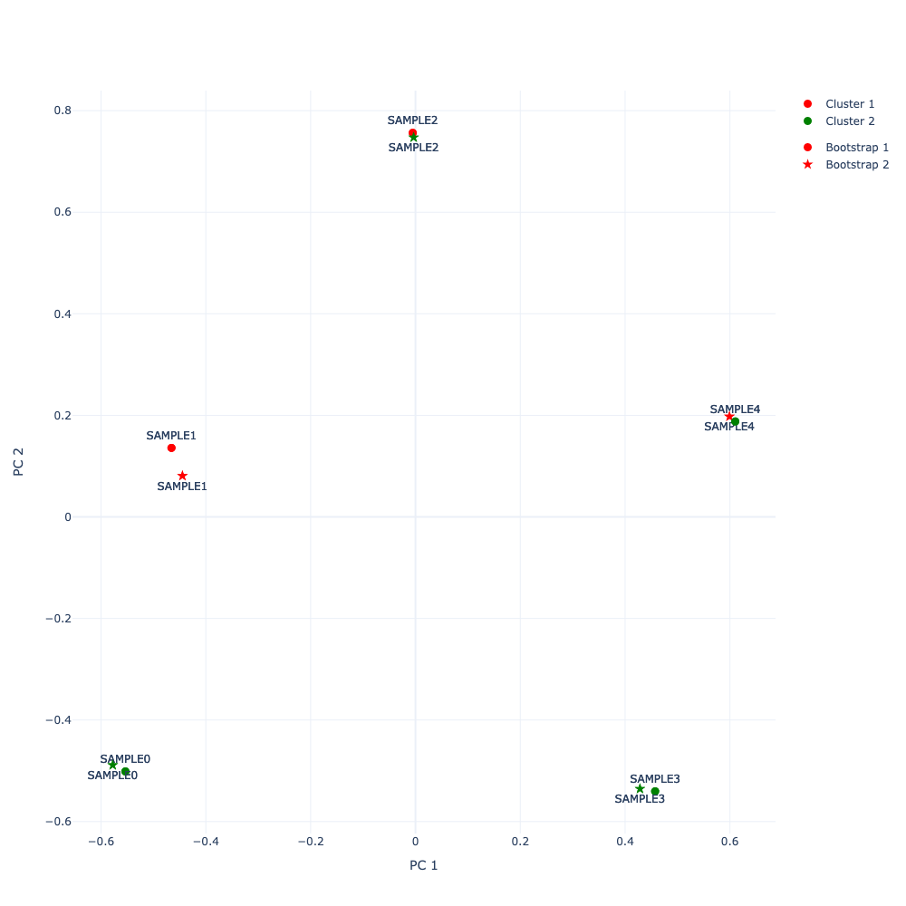

.. _Getting Started:

Getting Started
===============

This example demonstrates the basic usage of Pandora using the command line interface.

1. Setup Pandora and all requirements by following the :ref:`Installation` instructions.
2. To run this example, you need to clone the Pandora Git repo to obtain the example input files:

.. code-block:: shell

    git clone https://github.com/tschuelia/Pandora.git

3. In this repo, you will find an example configuration file ``example/config_example.yaml`` that looks like this:

.. code-block:: yaml

    dataset_prefix: example
    result_dir: results
    n_replicates: 10
    threads: 2
    seed: 42
    plot_results: True
    kmeans_k: 2
    smartpca_optional_settings:
      numoutlieriter: 0

This configuration tells Pandora to use ``example.*`` as input data and store the results in ``results``.
For this small example, we will estimate the stability using 10 bootstrap replicates. We further tell Pandora to use
2 threads for the parallel bootstrap computation and we set the random seed to 42 to make sure we get the same results
when rerunning Pandora with the same settings. We further tell Pandora to estimate the cluster stability when using two
clusters for K-Means clustering. And we tell Pandora to set ``numoutlieriter`` to 0 when invoking ``smartpca`` for the
PCA analyses. That means ``smartpca`` will not attempt to detect sample outliers.

If you decided to not install ``smartpca`` systemwide (or you are working on a MacBook with M1/M2 chip), you additionally
have to add the path to ``smartpca`` to the ``config-example.yaml``.

4. Run Pandora by typing:

.. code-block:: bash

    pandora -c config-example.yaml

You should then see an output similar to this:::

    Pandora version 2.0.0 released by The Exelixis Lab
    Developed by: Julia Haag
    Latest version: https://github.com/tschuelia/Pandora
    Questions/problems/suggestions? Please open an issue on GitHub.

    Pandora was called at 18-Apr-2024 16:26:50 as follows:

    /Users/julia/micromamba/envs/pandora/bin/pandora -c config_example.yaml

    --------- PANDORA CONFIGURATION ---------
    dataset_prefix: /Users/julia/Desktop/Promotion/ADNA_Popgen/Pandora/example/example
    result_dir: /Users/julia/Desktop/Promotion/ADNA_Popgen/Pandora/example/results
    file_format: EIGENSTRAT
    convertf: convertf
    n_replicates: 10
    keep_replicates: False
    bootstrap_convergence_check: True
    bootstrap_convergence_tolerance: 0.05
    n_components: 10
    embedding_algorithm: PCA
    smartpca: smartpca
    smartpca_optional_settings: {'numoutlieriter': 0}
    embedding_populations: None
    support_value_rogue_cutoff: 0.5
    kmeans_k: 2
    analysis_mode: BOOTSTRAP
    redo: False
    seed: 42
    threads: 2
    result_decimals: 2
    verbosity: 1
    plot_results: True
    plot_dim_x: 0
    plot_dim_y: 1

    --------- STARTING COMPUTATION ---------
    [00:00:02] Running SmartPCA on the input dataset.
    [00:00:02] Plotting embedding results for the input dataset.
    [00:00:18] Drawing 10 bootstrapped datasets and running PCA.
    [00:00:18] NOTE: Bootstrap convergence check is enabled. Will terminate bootstrap computation once convergence is determined. Convergence tolerance: 0.05
    [00:00:27] Bootstrapping done. Number of replicates computed: 10
    [00:00:27] Comparing bootstrapping embedding results.
    [00:00:34] Plotting bootstrapping embedding results.

    ========= PANDORA RESULTS =========
    > Input dataset: /Users/julia/Desktop/Promotion/ADNA_Popgen/Pandora/example/example

    > Performed Analysis: BOOTSTRAP
    > Number of replicates computed: 10
    > Number of Kmeans clusters: 2

    ------------------
    Results
    ------------------
    Pandora Stability: 1.0
    Pandora Cluster Stability: 0.39

    ------------------
    All Samples: Support values
    ------------------
    > average ± standard deviation: 0.98 ± 0.0
    > median: 0.98
    > lowest support value: 0.98
    > highest support value: 0.99

    ------------------
    Result Files
    ------------------
    > Pandora results: /Users/julia/Desktop/Promotion/ADNA_Popgen/Pandora/example/results/pandora.txt
    > Pairwise stabilities: /Users/julia/Desktop/Promotion/ADNA_Popgen/Pandora/example/results/pandora.replicates.csv
    > Sample Support values: /Users/julia/Desktop/Promotion/ADNA_Popgen/Pandora/example/results/pandora.supportValues.csv
    > All plots saved in directory: /Users/julia/Desktop/Promotion/ADNA_Popgen/Pandora/example/results/plots

    Total runtime: 0:00:37 (37 seconds)

So what is this telling us? First of all, Pandora will print all configurations. For all values you have not specifically
set in the ``config_example.yaml``, Pandora will use the default values as specified in the documentation.
Then it will continuously keep you updated on what it is currently working on and what it is computing.
Once everything is done, Pandora will print the results. This is probably the most interesting section to you and we will go into
more detail just a little below. Pandora will also tell you where you can find more detailed result files and where
it stored all results.
Finally, Pandora will print the total runtime to do the entire analysis. Since this is a very small dataset the computations
took only about halb a minute on my MacBook. For empirical population genetics datasets this will be more in the range of a few hours.
So, let's talk a bit about the results of this Pandora run:::

    ------------------
    Results
    ------------------
    Pandora Stability: 1.0
    Pandora Cluster Stability: 0.39

    ------------------
    All Samples: Support values
    ------------------
    > average ± standard deviation: 0.98 ± 0.0
    > median: 0.98
    > lowest support value: 0.98
    > highest support value: 0.99

The results tell you that based on the ten bootstraps Pandora computed, all bootstraps were overall basically the same, so we
obtain a Pandora Stability of 1.0. However, the Pandora Cluster Stability is only 0.39, how is that possible?
We can make sense of that by plotting two of the bootstrap PCAs. In the following figure, the circles are the projections
of the samples in one bootstrap, the stars the projection of the same samples in the other bootstrap.
First of all we can see that the two bootstraps match pretty closely, hence the high Pandora stability appears to make sense.
However, the colors indicate the assigned labels when applying K-Means clustering using 2 clusters. For the first bootstrap,
samples 0, 3, and 4 form a cluster, while in the second bootstrap, samples 0 and 3 are clustered with sample 2.
So apparently these little "distortions" in projecting the samples results in different cluster assignments.

Pandora further reports some summary statistics of the support values for all samples. The support values are values between
0 and 1, the higher the better. The lowest support value is 0.98 so we could say that all samples are stable in terms of
their projections across all bootstrap replicates. The reason why they are not all 1, despite a Pandora Stability of 1
makes sense if we again look at the plot above. The samples are in general projected pretty close to each other in both
bootstraps, but there is a small distortion so the support values are not exactly 1.
